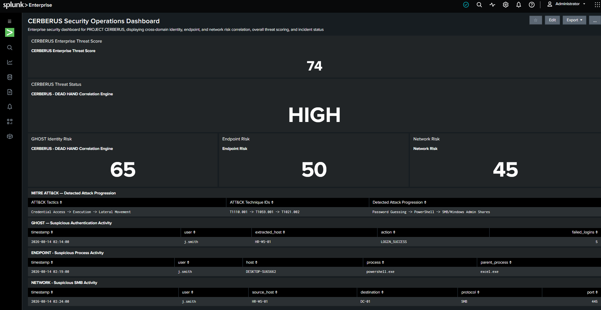
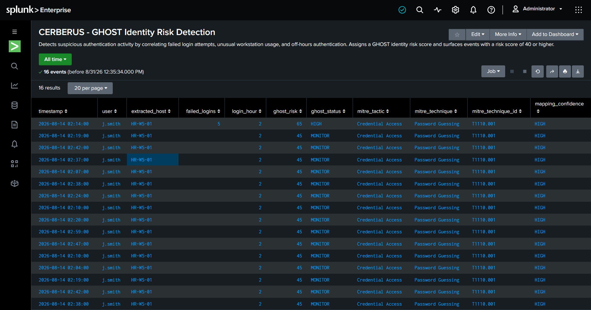
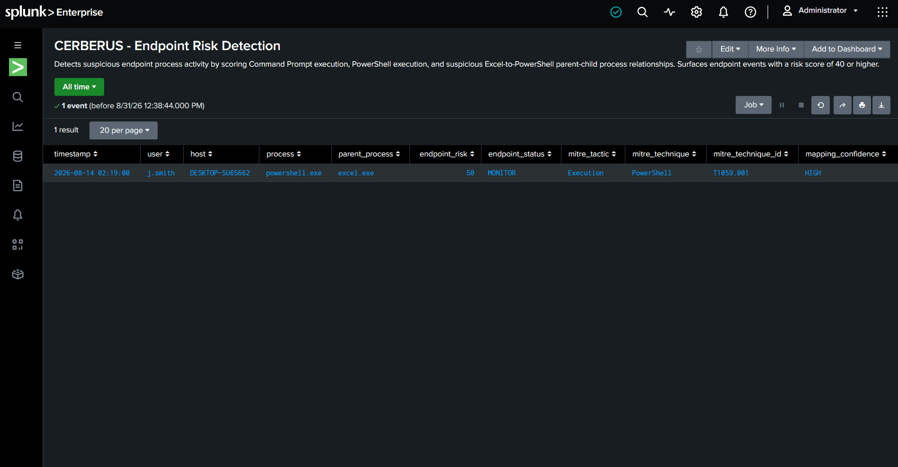
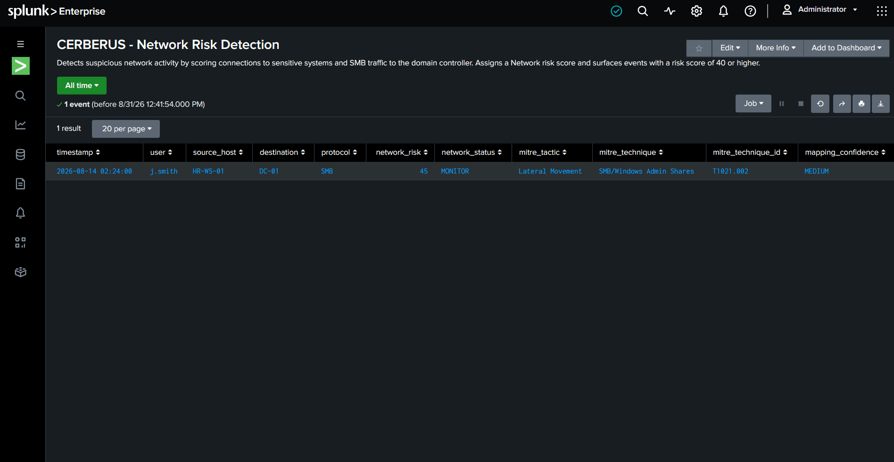
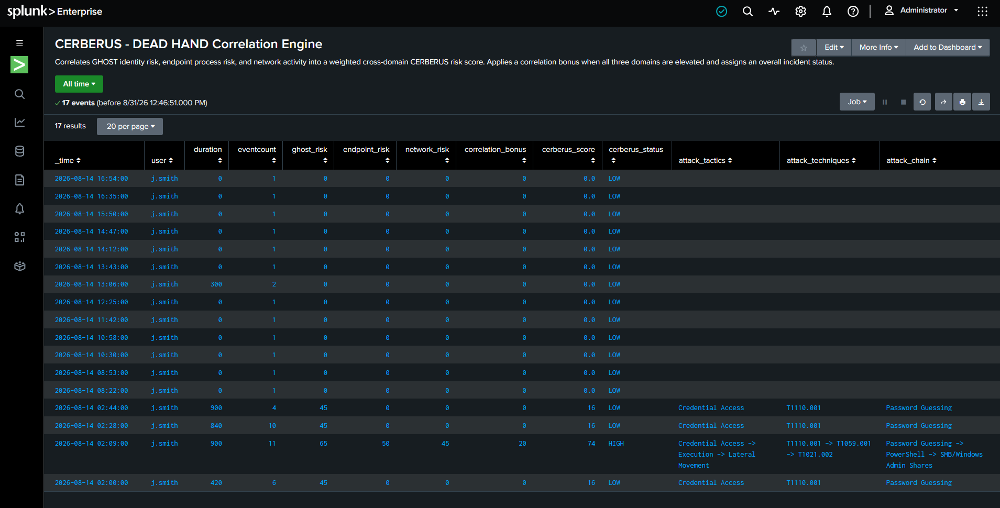

# PROJECT CERBERUS

> **Multi-Signal Detection & Correlation Engine**

PROJECT CERBERUS is a Splunk-based security detection and correlation project designed to identify suspicious activity across **identity, endpoint, and network telemetry**, calculate domain-specific risk scores, and correlate those signals into a unified security incident.

Rather than treating individual security events as isolated alerts, CERBERUS evaluates activity across multiple telemetry sources and uses the **DEAD HAND correlation engine** to identify when separate indicators form a larger attack sequence.

The project demonstrates a detection pipeline progressing from:

**Authentication Anomaly → Suspicious Process Execution → Lateral Movement**

The resulting activity is risk-scored, temporally correlated, mapped to the **MITRE ATT&CK framework**, and presented through a centralized Splunk Security Operations dashboard.

---

## Executive Summary

Security incidents rarely consist of a single obvious malicious event. An authentication anomaly may appear insignificant on its own. A PowerShell process may have a legitimate explanation. An SMB connection to a domain controller may also occur during normal administration.

The detection problem changes when those signals occur within the same user context and time window.

PROJECT CERBERUS was built to explore this problem.

The system analyzes three detection domains:

- **GHOST Identity Risk Detection** — evaluates suspicious authentication behavior.
- **Endpoint Risk Detection** — evaluates suspicious process execution and parent-child process relationships.
- **Network Risk Detection** — evaluates connections to sensitive systems and suspicious SMB activity.

These independent risk signals are passed into **DEAD HAND**, a correlation engine that groups activity by user within a 15-minute window, applies weighted risk scoring, and adds a correlation bonus when all three security domains are simultaneously elevated.

In the simulated attack scenario, CERBERUS correlated **11 events** associated with `j.smith` and identified:

| Detection Domain | Risk Score | Observed Activity |
|---|---:|---|
| Identity | 65 | Failed authentication activity from `HR-WS-01` during off-hours |
| Endpoint | 50 | `excel.exe` spawning `powershell.exe` |
| Network | 45 | SMB communication with `DC-01` |
| Correlation Bonus | +20 | Identity, endpoint, and network risk all exceeded correlation thresholds |
| **CERBERUS Score** | **74** | **HIGH** |

The correlated activity produced the following attack progression:

**Credential Access → Execution → Lateral Movement**

and was mapped to:

**T1110.001 → T1059.001 → T1021.002**

---

## Simulated Attack Scenario

CERBERUS models a multi-stage security incident involving the user `j.smith`.

### Stage 1 — Suspicious Authentication

The GHOST identity engine detects elevated authentication risk associated with `j.smith` on `HR-WS-01`.

The event includes failed login activity occurring during an off-hours period, causing the identity risk score to increase to **65**.

**MITRE ATT&CK**

- Tactic: Credential Access
- Technique: Password Guessing
- Technique ID: `T1110.001`
- Mapping Confidence: HIGH

### Stage 2 — Suspicious PowerShell Execution

Endpoint telemetry subsequently identifies:

`excel.exe → powershell.exe`

This parent-child process relationship is treated as suspicious because an Office application spawning PowerShell can represent script or command execution initiated through a document or user interaction.

The resulting endpoint risk score is **50**.

**MITRE ATT&CK**

- Tactic: Execution
- Technique: PowerShell
- Technique ID: `T1059.001`
- Mapping Confidence: HIGH

### Stage 3 — SMB Activity to the Domain Controller

Network telemetry then identifies SMB communication from `HR-WS-01` to `DC-01`.

The network engine assigns a risk score of **45**.

**MITRE ATT&CK**

- Tactic: Lateral Movement
- Technique: SMB/Windows Admin Shares
- Technique ID: `T1021.002`
- Mapping Confidence: MEDIUM

### Correlated Incident

Individually, each signal provides only part of the investigation.

Together, they produce a more significant sequence:

`Password Guessing → PowerShell → SMB/Windows Admin Shares`

DEAD HAND correlates the signals within a **15-minute user-centric transaction window**, producing:

`GHOST 65 + Endpoint 50 + Network 45 + Correlation Bonus 20 → CERBERUS Score 74 (HIGH)`

This allows CERBERUS to elevate a sequence of individually suspicious events into a single cross-domain security incident.

## System Architecture

PROJECT CERBERUS uses a layered detection and correlation architecture designed to simulate how a Security Operations Center (SOC) can transform raw security telemetry into a prioritized security incident.

The architecture separates detection into three security domains before correlating the results through the DEAD HAND correlation engine.

```text
                    PROJECT CERBERUS

                  RAW SECURITY TELEMETRY
                           |
          +----------------+----------------+
          |                |                |
          v                v                v
   AUTHENTICATION       ENDPOINT          NETWORK
       EVENTS            EVENTS            EVENTS
          |                |                |
          v                v                v
   +-------------+   +-------------+   +-------------+
   |    GHOST    |   |  ENDPOINT   |   |   NETWORK   |
   |  Identity   |   |    Risk     |   |    Risk     |
   | Detection   |   | Detection   |   | Detection   |
   +-------------+   +-------------+   +-------------+
          |                |                |
          | ghost_risk     | endpoint_risk  | network_risk
          |                |                |
          +----------------+----------------+
                           |
                           v
                 +-------------------+
                 |     DEAD HAND     |
                 | Correlation Engine|
                 +-------------------+
                           |
                           v
                   CERBERUS RISK SCORE
                           |
                           v
                  INCIDENT SEVERITY
                           |
                           v
                    MITRE ATT&CK
                       MAPPING
                           |
                           v
                 SECURITY OPERATIONS
                      DASHBOARD


```

## Detection & Risk Scoring Logic

CERBERUS uses risk-based detection rather than relying on a single binary alert. Each detection domain evaluates different security signals and assigns a numerical risk score based on the observed behavior.

The DEAD HAND correlation engine then combines those domain scores into an overall CERBERUS incident score.

### GHOST Identity Risk

GHOST evaluates authentication activity for indicators of potential account compromise.

Risk is increased when CERBERUS observes:

- Multiple failed authentication attempts
- Authentication involving an unusual or monitored workstation
- Authentication occurring during off-hours

During the simulated attack, GHOST identified suspicious authentication activity associated with `j.smith` and `HR-WS-01`.

**Observed GHOST Risk: `65`**

This represented the strongest individual signal in the incident and mapped the activity to:

- **MITRE ATT&CK Tactic:** Credential Access
- **Technique:** Password Guessing
- **Technique ID:** `T1110.001`
- **Mapping Confidence:** HIGH

### Endpoint Risk

The endpoint detection engine evaluates process execution and parent-child process relationships.

CERBERUS specifically scores suspicious command execution behavior, including:

- Command Prompt execution
- PowerShell execution
- Suspicious parent-child process relationships

The simulated attack produced:

`excel.exe → powershell.exe`

This behavior resulted in:

**Observed Endpoint Risk: `50`**

The activity was mapped to:

- **MITRE ATT&CK Tactic:** Execution
- **Technique:** PowerShell
- **Technique ID:** `T1059.001`
- **Mapping Confidence:** HIGH

### Network Risk

The network detection engine evaluates connections to sensitive infrastructure and suspicious protocol usage.

During the simulated attack, CERBERUS observed SMB communication from `HR-WS-01` to the domain controller `DC-01` over port `445`.

This resulted in:

**Observed Network Risk: `45`**

The activity was mapped to:

- **MITRE ATT&CK Tactic:** Lateral Movement
- **Technique:** SMB/Windows Admin Shares
- **Technique ID:** `T1021.002`
- **Mapping Confidence:** MEDIUM

### Weighted Cross-Domain Scoring

DEAD HAND does not simply add the three raw domain scores together.

Instead, CERBERUS applies weighting to each security domain so that different classes of telemetry contribute proportionally to the final incident score.

For the correlated attack sequence, the domain scores were:

| Security Domain | Raw Risk Score |
|---|---:|
| GHOST Identity | 65 |
| Endpoint | 50 |
| Network | 45 |

The weighted domain scores are then combined before correlation logic is applied.

### Correlation Bonus

CERBERUS becomes more sensitive when suspicious behavior appears across multiple security domains within the same investigation window.

When identity, endpoint, and network risk are all elevated within the **15-minute user-centric transaction window**, DEAD HAND applies a:

**Correlation Bonus: `+20`**

This represents increased confidence that the individual detections are related components of the same attack rather than unrelated security events.

### Final CERBERUS Score

For the simulated attack, DEAD HAND correlated:

`Credential Access → Execution → Lateral Movement`

with the attack progression:

`Password Guessing → PowerShell → SMB/Windows Admin Shares`

The correlation engine produced the final result:

| Component | Result |
|---|---:|
| GHOST Risk | 65 |
| Endpoint Risk | 50 |
| Network Risk | 45 |
| Correlation Bonus | +20 |
| **Final CERBERUS Score** | **74** |
| **Incident Status** | **HIGH** |

The final score demonstrates the central concept behind PROJECT CERBERUS: **security signals that may appear moderate in isolation can represent a substantially higher-risk incident when correlated across identity, endpoint, and network telemetry.**


### DEAD HAND SPL Implementation

The full DEAD HAND correlation logic is available in:

[`detections/dead_hand_correlation.spl`](detections/dead_hand_correlation.spl)

DEAD HAND uses Splunk Search Processing Language (SPL) to correlate security telemetry, calculate cross-domain risk, and dynamically construct a MITRE ATT&CK attack path.

#### 1. Temporal Correlation

DEAD HAND begins by grouping events associated with the same user into a maximum 15-minute investigation window:

```spl
| transaction user maxspan=15m
```

This allows CERBERUS to correlate authentication, endpoint, and network events that occur at different timestamps but may belong to the same security incident.

For the simulated incident, DEAD HAND correlated **11 events** associated with `j.smith` across the 15-minute window.

#### 2. Multivalue Detection

The `transaction` command can produce multivalue fields when multiple events contain different values for the same field.

DEAD HAND therefore uses `mvfind()` to determine whether specific security indicators are present anywhere within the correlated transaction.

Examples include:

```spl
mvfind(process, "powershell.exe") >= 0
mvfind(parent_process, "excel.exe") >= 0
mvfind(destination, "DC-01") >= 0
mvfind(protocol, "SMB") >= 0
```

This allows CERBERUS to evaluate endpoint and network indicators across the complete correlated event set rather than requiring all suspicious activity to occur at an identical timestamp.

#### 3. Domain Risk Calculation

After correlation, DEAD HAND calculates risk independently across the identity, endpoint, and network domains.

Examples of evaluated indicators include:

**Identity**
- Repeated failed authentication attempts
- Activity associated with `HR-WS-01`
- Off-hours authentication

**Endpoint**
- `cmd.exe` execution
- `powershell.exe` execution
- `excel.exe → powershell.exe` parent-child execution

**Network**
- Connections to `FIN-SRV-01`
- Connections to `DC-01`
- SMB activity involving `DC-01`

This produces the three domain risk values used by the correlation engine:

```text
ghost_risk
endpoint_risk
network_risk
```

#### 4. Weighted Risk Correlation

DEAD HAND applies weighting to each detection domain:

```spl
| eval weighted_ghost=ghost_risk * 0.35
| eval weighted_endpoint=endpoint_risk * 0.35
| eval weighted_network=network_risk * 0.30
```

The weighting model assigns:

- **35%** to identity risk
- **35%** to endpoint risk
- **30%** to network risk

This prevents the final incident score from being calculated as a simple sum of independent detection scores.

#### 5. Cross-Domain Correlation Bonus

DEAD HAND evaluates whether all three detection domains have reached the correlation threshold:

```spl
| eval correlation_bonus=if(
    ghost_risk >= 40
    AND endpoint_risk >= 40
    AND network_risk >= 40,
    20,
    0
)
```

When all three domains reach a risk score of at least `40`, CERBERUS adds a **20-point correlation bonus**.

The bonus represents the increased significance of suspicious activity appearing across identity, endpoint, and network telemetry within the same user-centric investigation window.

#### 6. Final Incident Scoring

The weighted domain scores and correlation bonus are combined into the final CERBERUS score:

```spl
| eval cerberus_score=weighted_ghost + weighted_endpoint + weighted_network + correlation_bonus
```

DEAD HAND then assigns an incident status:

```spl
| eval cerberus_status=case(
    cerberus_score >= 75, "CRITICAL",
    cerberus_score >= 60, "HIGH",
    cerberus_score >= 40, "MONITOR",
    true(), "LOW"
)
```

The current severity model is:

| CERBERUS Score | Status |
|---:|---|
| 75+ | CRITICAL |
| 60–74.99 | HIGH |
| 40–59.99 | MONITOR |
| Below 40 | LOW |

The simulated incident produced a score of `73.75`, displayed as **74**, resulting in a **HIGH** incident status.

#### 7. Dynamic MITRE ATT&CK Enrichment

DEAD HAND does not statically assign every ATT&CK technique to every incident.

Instead, ATT&CK techniques are added only when their corresponding detection domain crosses the risk threshold:

```spl
| eval ghost_mitre=if(ghost_risk >= 40, "T1110.001", null())
| eval endpoint_mitre=if(endpoint_risk >= 40, "T1059.001", null())
| eval network_mitre=if(network_risk >= 40, "T1021.002", null())
```

The resulting techniques are combined using `mvappend()` and `mvjoin()` to dynamically construct the detected attack progression.

For the simulated incident, CERBERUS generated:

```text
Credential Access → Execution → Lateral Movement

T1110.001 → T1059.001 → T1021.002

Password Guessing → PowerShell → SMB/Windows Admin Shares
```

This means the ATT&CK path displayed by CERBERUS is derived from the detection domains that actually triggered rather than being a static dashboard label.

---

## MITRE ATT&CK Mapping & Detection Rationale

CERBERUS maps detected behaviors to MITRE ATT&CK based on the telemetry available to each detection engine. Mapping confidence is used to distinguish strongly supported mappings from mappings where the available telemetry has limitations.

| Detection | Tactic | Technique | Technique ID | Confidence |
|---|---|---|---|---|
| GHOST Identity | Credential Access | Password Guessing | `T1110.001` | HIGH |
| Endpoint | Execution | PowerShell | `T1059.001` | HIGH |
| Network | Lateral Movement | SMB/Windows Admin Shares | `T1021.002` | MEDIUM |

### GHOST — Password Guessing

GHOST identifies repeated failed authentication attempts associated with a user account.

Repeated authentication failures can indicate attempts to systematically guess a valid password, aligning the observed behavior with the **Credential Access** tactic and **Password Guessing (`T1110.001`)** sub-technique.

The mapping is assigned **HIGH confidence** because the authentication telemetry directly provides evidence of repeated failed login activity.

### Endpoint — PowerShell

The Endpoint engine identifies PowerShell execution and assigns additional risk when `powershell.exe` is spawned by an unusual parent process such as `excel.exe`.

PowerShell provides a command and scripting environment that can be used to execute commands and scripts, aligning the observed behavior with the **Execution** tactic and **PowerShell (`T1059.001`)** sub-technique.

The mapping is assigned **HIGH confidence** because the endpoint telemetry directly identifies `powershell.exe` execution.

### Network — SMB/Windows Admin Shares

The Network engine identifies SMB activity directed toward an internal system such as `DC-01`.

SMB can support remote access and lateral movement between Windows systems, making the observed behavior consistent with **SMB/Windows Admin Shares (`T1021.002`)**.

However, the available telemetry does not directly establish access to a specific administrative share such as `ADMIN$` or `C$`.

For this reason, CERBERUS assigns the mapping **MEDIUM confidence** rather than treating T1021.002 as definitively confirmed.

### DEAD HAND — Cross-Domain ATT&CK Correlation

DEAD HAND correlates identity, endpoint, and network detections associated with the same user within a defined 15-minute window.

Rather than treating each signal independently, the correlation engine identifies a progression consistent with:

**Credential Access → Execution → Lateral Movement**

ATT&CK mappings are dynamically generated so that only techniques associated with detection domains that actually triggered are included in the resulting attack path.

---

## Dashboard & Investigation Evidence

The CERBERUS Security Operations dashboard presents the correlated incident from both a risk-scoring and analyst-investigation perspective.

The dashboard combines:

- Enterprise threat scoring
- Incident severity
- GHOST identity risk
- Endpoint risk
- Network risk
- Dynamic MITRE ATT&CK progression
- Authentication evidence
- Endpoint process evidence
- Network evidence

### Final CERBERUS Security Operations Dashboard



The final dashboard shows:

- **CERBERUS Enterprise Threat Score:** 74
- **Incident Status:** HIGH
- **GHOST Risk:** 65
- **Endpoint Risk:** 50
- **Network Risk:** 45
- **ATT&CK Progression:** Credential Access → Execution → Lateral Movement
- **Technique Chain:** `T1110.001 → T1059.001 → T1021.002`

The lower investigation panels preserve the underlying evidence that contributed to the correlated incident.

---

## Detection Evidence

### 1. GHOST Identity Detection



GHOST identified suspicious authentication activity associated with `j.smith`, including:

- `failed_logins = 5`
- `HR-WS-01`
- Off-hours authentication
- Identity risk score of **65**
- Status of **HIGH**
- MITRE ATT&CK mapping to `T1110.001 — Password Guessing`

This screenshot demonstrates the identity detection stage before cross-domain correlation occurs.

### 2. Endpoint PowerShell Detection



The Endpoint engine identified:

`excel.exe → powershell.exe`

The resulting detection produced:

- Endpoint risk score of **50**
- Status of **MONITOR**
- ATT&CK tactic: **Execution**
- Technique: **PowerShell**
- Technique ID: `T1059.001`
- Mapping confidence: **HIGH**

The screenshot demonstrates how process telemetry is transformed into an ATT&CK-enriched endpoint detection.

### 3. Network SMB Detection



The Network engine identified:

`HR-WS-01 → DC-01 → SMB`

The detection produced:

- Network risk score of **45**
- Status of **MONITOR**
- ATT&CK tactic: **Lateral Movement**
- Technique: **SMB/Windows Admin Shares**
- Technique ID: `T1021.002`
- Mapping confidence: **MEDIUM**

The MEDIUM confidence reflects the limitation that SMB communication is visible, but direct access to a specific administrative share such as `ADMIN$` or `C$` is not explicitly confirmed in the available telemetry.

### 4. DEAD HAND Correlation Engine



DEAD HAND correlated **11 events** associated with `j.smith` inside a 15-minute transaction window.

The correlated transaction produced:

| Component | Result |
|---|---:|
| GHOST Risk | 65 |
| Endpoint Risk | 50 |
| Network Risk | 45 |
| Correlation Bonus | +20 |
| CERBERUS Score | 74 |
| Incident Status | HIGH |

The same transaction dynamically generated:

```text
Credential Access → Execution → Lateral Movement

T1110.001 → T1059.001 → T1021.002

Password Guessing → PowerShell → SMB/Windows Admin Shares
```

This screenshot demonstrates the central thesis of PROJECT CERBERUS:

**Correlation > isolated detection.**

---

## Detection Limitations

PROJECT CERBERUS is a controlled detection-engineering simulation and intentionally operates with a simplified telemetry model. The detections demonstrate correlation and risk-scoring concepts, but several limitations would need to be addressed in a production Security Operations Center (SOC).

### Identity Detection Limitations

GHOST currently evaluates authentication risk using indicators such as failed login volume, workstation association, and authentication time.

Current limitations include:

- Fixed risk thresholds rather than dynamically learned user baselines
- No geographic or impossible-travel analysis
- No source IP reputation enrichment
- No Multi-Factor Authentication (MFA) telemetry
- No Active Directory or identity-provider context
- No distinction between expected administrative activity and anomalous user behavior

A production implementation could incorporate historical authentication baselines and identity context to improve detection precision.

### Endpoint Detection Limitations

The Endpoint engine evaluates process names and parent-child relationships but does not inspect full command-line activity.

For example:

`excel.exe → powershell.exe`

is suspicious and receives additional risk, but PowerShell execution alone does not establish malicious intent.

Additional endpoint telemetry could include:

- Full process command lines
- PowerShell Script Block Logging
- Process hashes
- Digital signature information
- Endpoint Detection and Response (EDR) telemetry
- File creation and modification activity
- Network connections associated with processes

These data sources would provide additional context for determining whether execution was malicious or legitimate.

### Network Detection Limitations

The Network engine identifies suspicious destinations and SMB activity but has limited visibility into the actual SMB operation performed.

For example:

`HR-WS-01 → DC-01 → SMB`

supports investigation of potential lateral movement, but it does not independently prove that an administrative share was accessed.

This is why the `T1021.002 — SMB/Windows Admin Shares` mapping is assigned **MEDIUM** confidence.

Additional telemetry such as Windows share-access events, firewall logs, network flow data, or packet-level evidence could increase mapping confidence.

### Correlation Limitations

DEAD HAND currently uses:

```spl
| transaction user maxspan=15m
```

This provides an effective demonstration of user-centric temporal correlation but has several production limitations.

At larger scale, `transaction` can become computationally expensive because Splunk must retain and group events before producing results.

A production implementation could instead use:

- `stats`
- `eventstats`
- Time-bucketed aggregation
- Summary indexing
- Data models
- Risk-based alerting
- Scheduled correlation searches

The 15-minute correlation window is also a fixed design choice for this simulation. A production system would tune correlation windows based on the behavior being detected.

---

## Repository Structure

```text
PROJECT-CERBERUS/
│
├── detections/
│   ├── ghost_identity_detection.spl
│   ├── endpoint_risk_detection.spl
│   ├── network_risk_detection.spl
│   └── dead_hand_correlation.spl
│
├── screenshots/
│   ├── 01-ghost-identity-detection.png
│   ├── 02-endpoint-powershell-detection.png
│   ├── 03-network-smb-detection.png
│   ├── 04-dead-hand-correlation.png
│   └── 05-cerberus-security-operations-dashboard.png
│
└── README.md
```

The repository separates detection logic from investigation evidence so that the SPL implementation can be reviewed independently from the resulting detections and dashboard output.

---

## Skills Demonstrated

PROJECT CERBERUS demonstrates practical experience across several areas of defensive security and detection engineering.

### Splunk & SPL

- Splunk Search Processing Language (SPL)
- Event searching and field analysis
- `eval`-based detection logic
- Conditional scoring with `if()` and `case()`
- Multivalue field analysis with `mvfind()`
- Multivalue construction with `mvappend()`
- Multivalue formatting with `mvjoin()`
- User-centric event correlation with `transaction`
- Risk scoring and severity classification
- Dashboard development

### Detection Engineering

- Behavior-based detection design
- Multi-signal detection
- Risk-based detection
- Detection threshold development
- Identity risk analysis
- Endpoint process analysis
- Network activity analysis
- Cross-domain event correlation
- Detection confidence assessment
- False-positive and telemetry limitation analysis

### Security Operations

- Authentication investigation
- Suspicious process investigation
- Network activity investigation
- Incident prioritization
- Cross-domain telemetry analysis
- Security event correlation
- Analyst-oriented dashboard design
- Evidence-driven incident reconstruction

### MITRE ATT&CK

- ATT&CK tactic mapping
- ATT&CK technique mapping
- Detection-to-technique alignment
- Mapping confidence assessment
- Dynamic attack-chain construction

The simulated incident demonstrates detection and correlation across:

```text
Credential Access
      ↓
Execution
      ↓
Lateral Movement
```

with the corresponding techniques:

```text
T1110.001
Password Guessing
      ↓
T1059.001
PowerShell
      ↓
T1021.002
SMB/Windows Admin Shares
```

---

## Future Improvements

PROJECT CERBERUS could be expanded into a more production-oriented detection architecture by introducing additional telemetry, enrichment, and correlation capabilities.

Potential improvements include:

- Replace `transaction` with scalable `stats`-based correlation
- Introduce user and host behavioral baselines
- Add source IP and threat-intelligence enrichment
- Incorporate Windows Event Log telemetry
- Add PowerShell Script Block Logging
- Integrate Sysmon process and network telemetry
- Incorporate Endpoint Detection and Response (EDR) data
- Add DNS telemetry
- Add firewall and network-flow telemetry
- Develop additional ATT&CK-aligned detections
- Add risk decay so older activity contributes less to current incident severity
- Introduce host-centric and asset-centric correlation in addition to user-centric correlation
- Add privileged-account and critical-asset weighting
- Create scheduled correlation searches and alerting
- Add analyst disposition fields for true positive, false positive, and benign positive classifications
- Measure detection performance using false-positive rates and detection coverage

A larger implementation could also separate the individual detection engines from the correlation layer and treat CERBERUS as a centralized risk aggregation system consuming detections from multiple security tools.

---

## Project Conclusion

PROJECT CERBERUS was built to explore a fundamental detection-engineering problem:

**How can multiple moderate security signals be combined to identify a higher-risk incident that may not be obvious from any individual alert?**

The project approaches this problem through four layers:

```text
Security Telemetry
        ↓
Domain Detection
        ↓
Risk Scoring
        ↓
Cross-Domain Correlation
        ↓
Incident Prioritization
```

GHOST analyzes authentication behavior.

The Endpoint engine analyzes suspicious process execution.

The Network engine analyzes suspicious internal communication.

DEAD HAND correlates those independent detections within a shared user-centric investigation window and produces a weighted CERBERUS risk score.

In the simulated attack, individually moderate signals were correlated into the progression:

`Password Guessing → PowerShell → SMB/Windows Admin Shares`

mapped across:

`Credential Access → Execution → Lateral Movement`

The resulting **CERBERUS score of 74** elevated the activity to a **HIGH-priority incident**.

PROJECT CERBERUS demonstrates how risk-based correlation can reduce dependence on isolated alerts and provide analysts with a more complete representation of suspicious activity occurring across identity, endpoint, and network telemetry.
